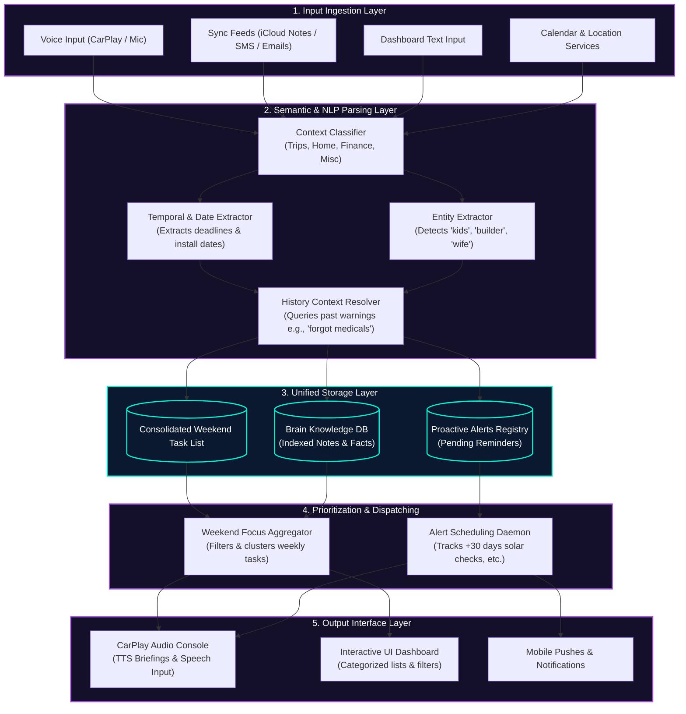

# OmniMind Architecture Flow: De-fragmenting Scattered Information

This document details the architectural layout of the **OmniMind Personal Brain System**, focusing on how unstructured and fragmented inputs (emails, texts, notes, voice) are unified into a prioritized weekend task checklist and context-aware CarPlay alerts.

---

## 🏗️ System Architecture Flow

The following Mermaid diagram outlines the end-to-end ingestion, semantic extraction, storage, and presentation workflow:

---

## 🔍 Detailed Component Walkthrough

### 1. Input Ingestion Layer
Scattered items enter the brain through different channels:
*   **Active Capture**: Voice dictation during commutes (e.g. CarPlay) or quick typed dashboard notes.
*   **Passive Capture**: Background scanning of external text feeds (i.e. forwarding emails, parsing SMS notifications from contractors, or syncing collaborative family notes).

### 2. Semantic & NLP Parsing Layer
This is the core parsing logic that turns disorganized text into structured database fields:
*   **Context Classifier**: Understands the domain of the note. For example, if it detects "drywall", "builder", or "tile", it routes to the *Home Maintenance* group.
*   **Temporal & Date Extractor**: Scans for exact dates (e.g. "6/19") or relative terms (e.g. "next month", "after a month") and maps them to true ISO dates.
*   **Entity Extractor**: Identifies crucial stakeholders. Knowing "wife asked" raises the task priority, while "kids" triggers family-safety templates.
*   **History Context Resolver**: Cross-references new entries with historical patterns. If a travel entity is detected, it searches history for travel mishaps (e.g., *"forgot medical kit"* last trip) to append proactive warnings.

### 3. Unified Storage Layer
Information is stored in normalized schemas:
*   **Brain Knowledge DB**: Read-only reference index (e.g. "Solar was installed on 6/19").
*   **Proactive Alerts Registry**: Actionable time-based or location-based alerts.
*   **Weekend Task List**: The actionable todo items.

### 4. Prioritization & Dispatching
Instead of presenting a massive, scrolling list of todos:
*   **Weekend Focus Aggregator**: Collects all tasks logged during the week that do not have an active weekday deadline. It groups them by domain (e.g. group all builder complaints together) and constructs a consolidated **Weekend Priority List** to prevent weekday cognitive overload.
*   **Alert Scheduling Daemon**: Evaluates date parameters. It computes intervals (e.g., Solar Installation Date `2026-06-19` + 30 days = Alert Date `2026-07-19`) and schedules push triggers.

### 5. Output Interface Layer
*   **CarPlay Console**: Focused on voice. Delivers short briefings (e.g. *"You have 4 builder complaints to file this weekend. Would you like me to draft them?"*) and accepts hands-free voice commands.
*   **Web/Mobile Dashboard**: Glassmorphic, highly visual dashboard designed for detailed reviews, indexing filters, and modal-based audits.
